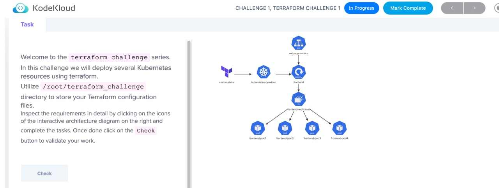

# Challenge1




## Install Terraform on controlplane

### Checks

- [ ] Terraform version: 1.1.5 installed on controlplane?

### Solution

Followed: https://developer.hashicorp.com/terraform/tutorials/aws-get-started/install-cli

Then locked the version:

```bash
sudo apt install terraform=1.1.5
```

## Setup kubernetes provider

- [ ] Configure terraform and provider settings within provider.tf file with following specifications:
- [ ] Configure terraform to use hashicorp/kubernetes provider.
- [ ] Specify the provider's local name: kubernetes
      Provider version: 2.11.0
- [ ] Configure kubernetes provider with path to your kubeconfig file: /root/.kube/config

### Solution

See [provider.tf](./provider.tf)

## Deploy the service

### Checks

Create a terraform resource webapp-service for kubernetes service with following specs:

- [ ] Service name: webapp-service
- [ ] Service Type: NodePort
- [ ] Port: 8080
- [ ] NodePort: 30080

### Solution

See [main.tf](./main.tf)

## Deploy the front-end application

### Checks

Create a terraform resource frontend for kubernetes deployment with following specs:

- [ ] Deployment Name: frontend
- [ ] Deployment Labels = name: frontend
- [ ] Replicas: 4
- [ ] Pod Labels = name: webapp
- [ ] Image: kodekloud/webapp-color:v1
- [ ] Container name: simple-webapp
- [ ] Container port: 8080

### Solution

See [main.tf](./main.tf
