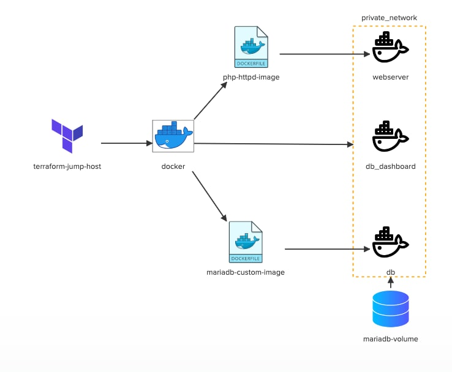

# Challenge 2 

In this challenge we will implement a simple LAMP stack using terraform and docker.



## Install Terraform on controlplane

### Checks

- [ ] Terraform version: 1.1.5 installed on controlplane?

### Solution

Followed: https://developer.hashicorp.com/terraform/tutorials/aws-get-started/install-cli

Then locked the version:

```bash
sudo apt-get update && sudo apt-get install -y gnupg software-properties-common
wget -O- https://apt.releases.hashicorp.com/gpg | \
    gpg --dearmor | \
    sudo tee /usr/share/keyrings/hashicorp-archive-keyring.gpg
echo "deb [signed-by=/usr/share/keyrings/hashicorp-archive-keyring.gpg] \
    https://apt.releases.hashicorp.com $(lsb_release -cs) main" | \
    sudo tee /etc/apt/sources.list.d/hashicorp.list
sudo apt update
sudo apt install terraform=1.1.5
```


## For the rest of challenges check TF files